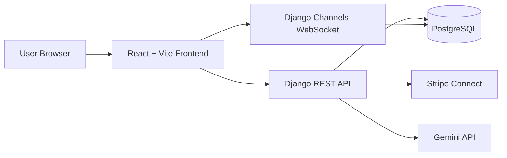
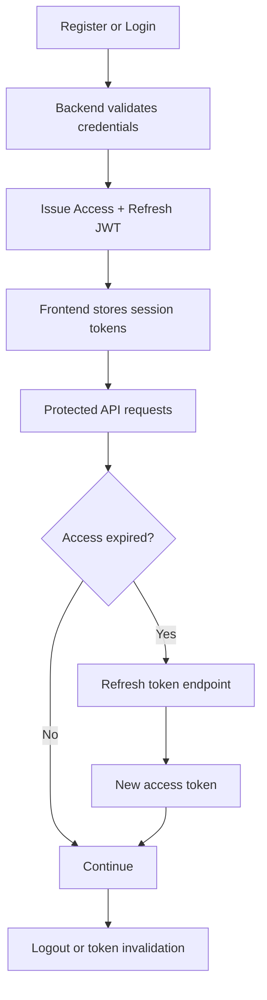
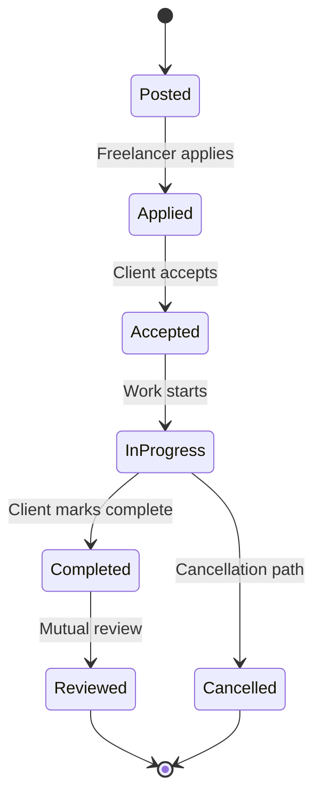
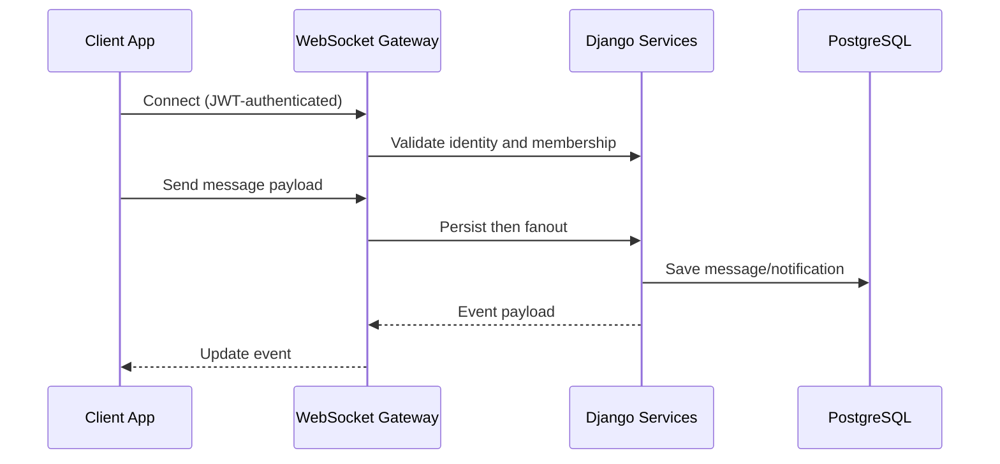
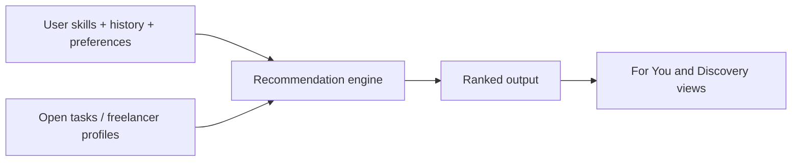
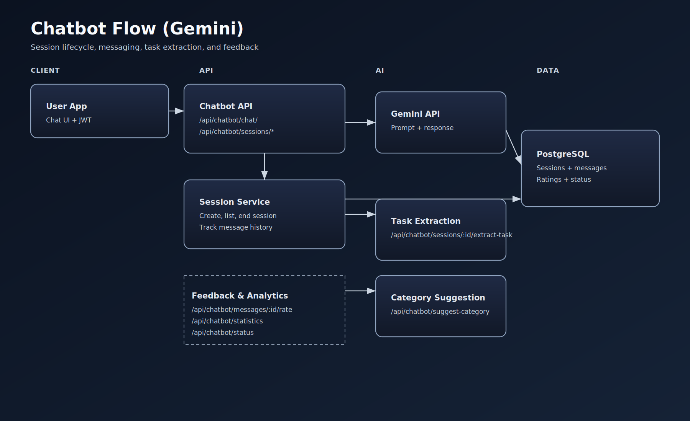

# Architecture

This page documents the platform at system-boundary level rather than implementation-level code details.

## Architecture Goals

- Keep frontend, API, realtime, and payment concerns separated.
- Enforce role-aware permissions at service boundaries.
- Persist critical events before fanout to ensure recoverability.
- Keep external providers (payments and AI) isolated behind backend services.

## 1) System Topology

### Boundary Notes

- Frontend handles UI state and authenticated request orchestration.
- REST API owns domain rules, role checks, and transaction state.
- Channels layer handles low-latency fanout for chat and notifications.
- PostgreSQL is the system of record for durable state.

## 2) Authentication Lifecycle

## 3) Task State Machine

## 4) Realtime Delivery Path

## 5) Recommendation Path

## 6) AI Assistant Path

## UI Validation Points

| Domain | Preview |
|---|---|
| Dashboard shell |  |
| Task details |  |
| Messaging |  |
| Wallet |  |

## Related Pages

- [Features](features.md)
- [API](api.md)
- [Realtime](realtime.md)
- [Payments](payments.md)
- [Security](security.md)
