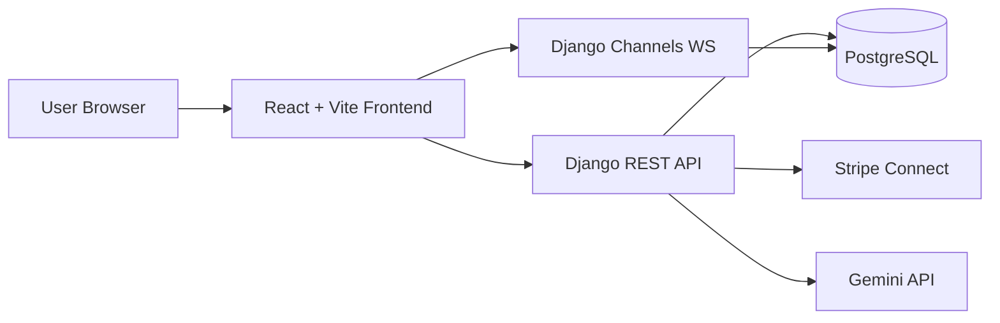
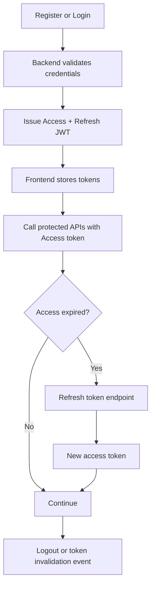
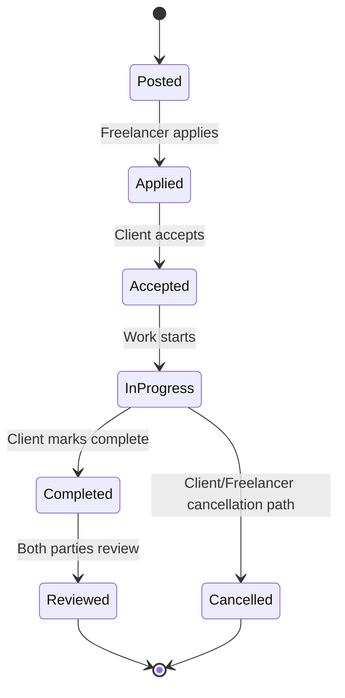
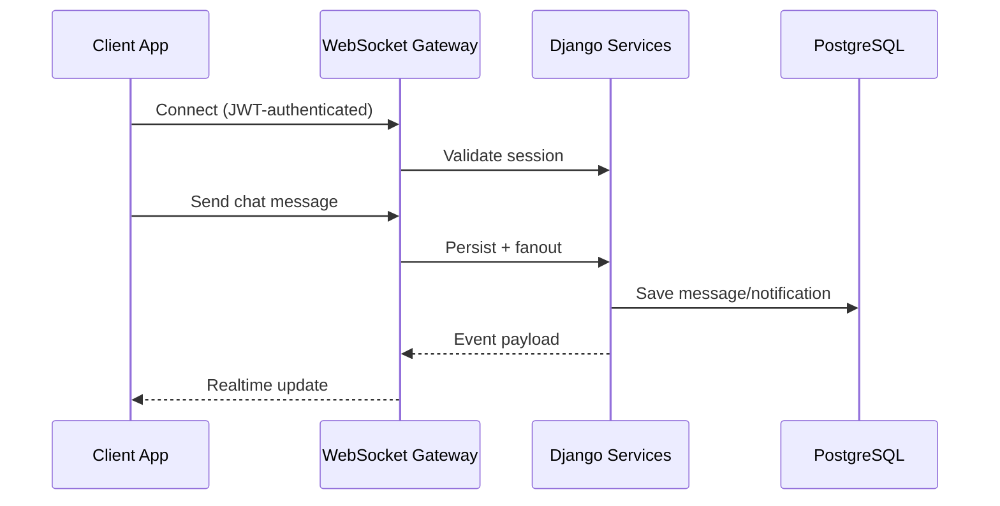
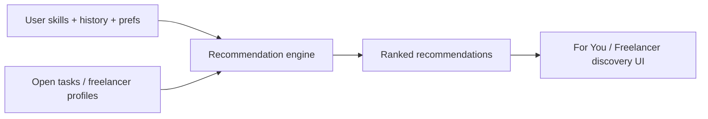

# Architecture

This page explains behavior using diagrams instead of implementation-level detail.

## 1) System Architecture

## 2) Authentication Flow

## 3) Task Lifecycle

## 4) Realtime Flow

## 5) Recommendations Flow

## 6) Chatbot Flow

## Notes
- Architecture prioritizes clear API boundaries and event-driven user feedback.
- Realtime events are persisted so users can recover state after reconnect.
- Payments and recommendations are isolated domains integrated via backend services.
