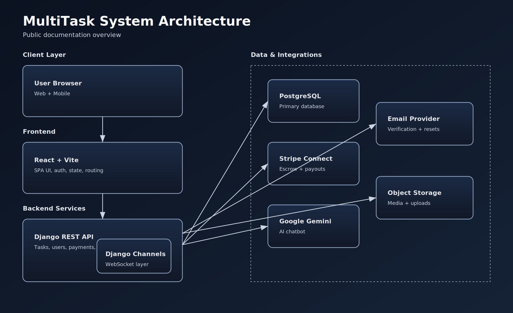
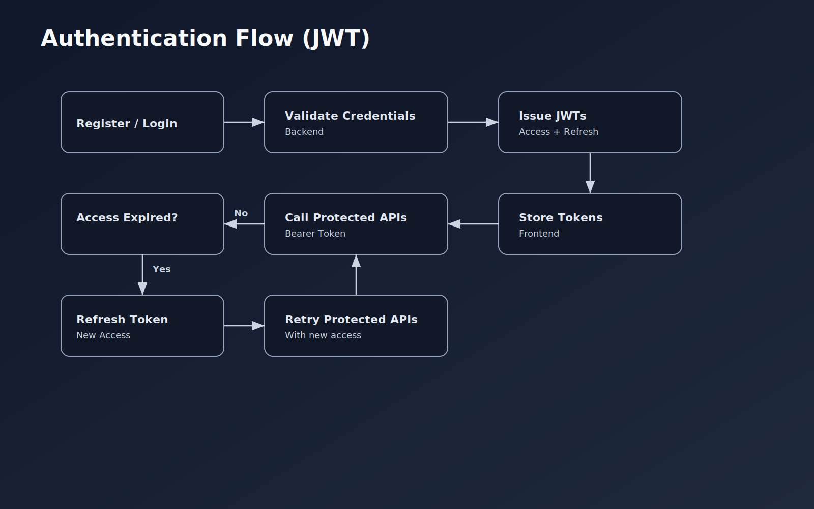
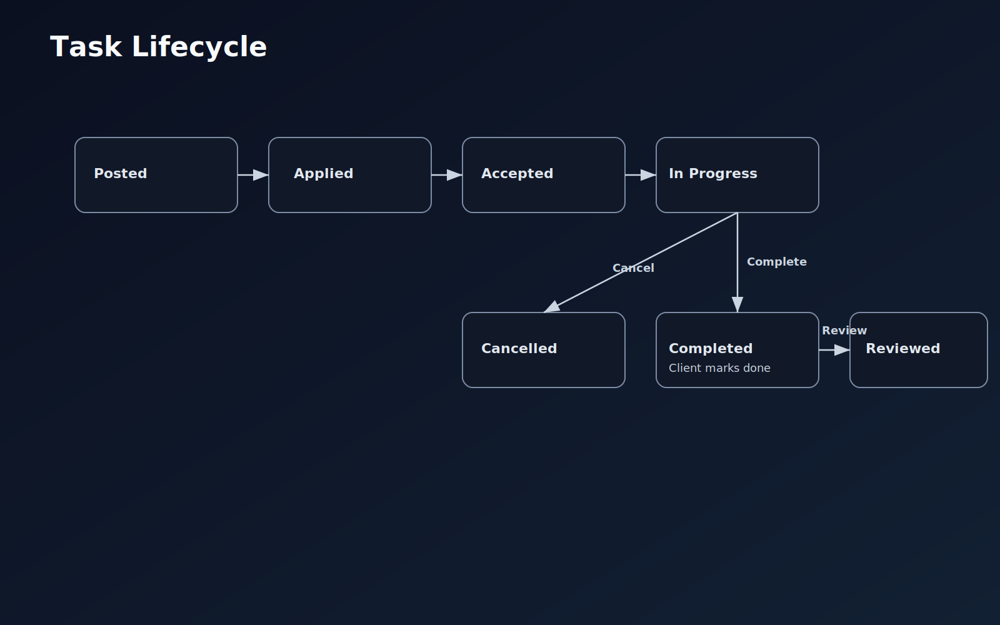
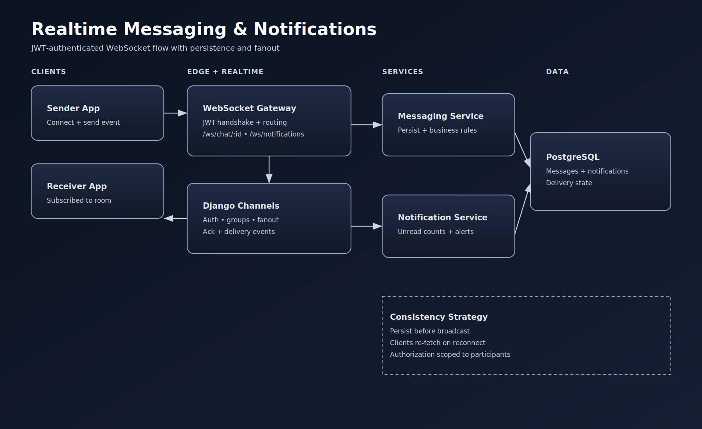
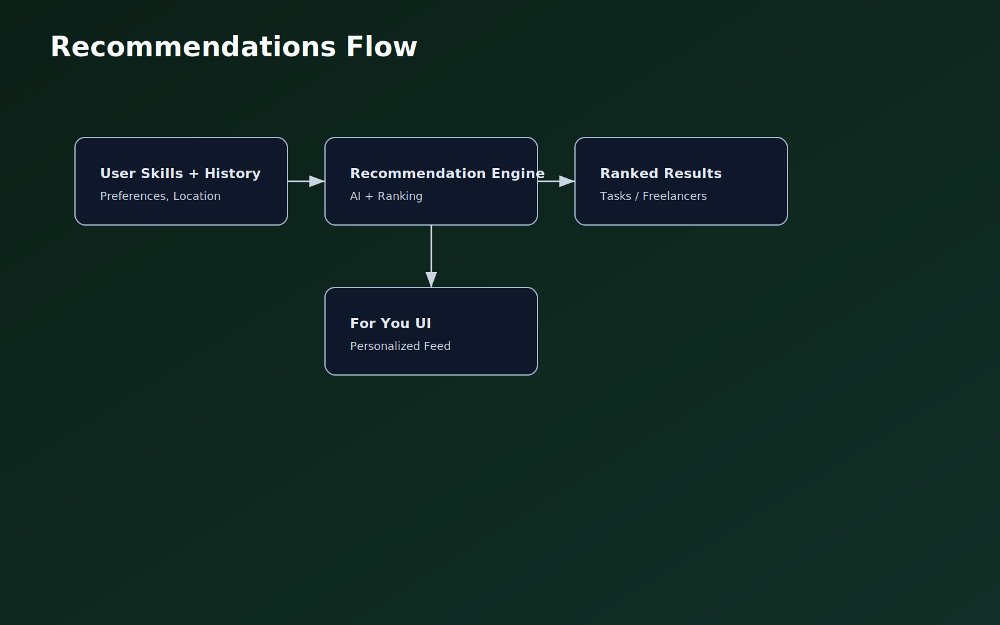

# MultiTask

MultiTask is a task marketplace platform where clients and freelancers collaborate on short and mid-sized projects.

## Who It Is For
- Clients who need trusted delivery for posted tasks.
- Freelancers who want a structured pipeline for applying, delivering, and getting paid.
- Hybrid users who both hire and deliver.

## Core Capabilities
- Task posting, applications, acceptance, delivery, completion, and reviews.
- Role-aware navigation and permissions (`is_client`, `is_freelancer`).
- Real-time messaging and notifications via WebSockets.
- Escrow-style payment flow using Stripe Connect (current phase).
- AI-assisted recommendations for tasks and talent discovery.
- AI chatbot support via Google Gemini API.

## Tech Stack
- Frontend: React 18, Vite, Tailwind CSS
- Backend: Django 5, Django REST Framework
- Database: PostgreSQL
- Realtime: Django Channels
- Payments: Stripe Connect (Egypt provider planned)
- AI: Google Gemini API (chatbot)

## Product Flows

## Demo
- Demo video: _add your public video URL here_

## Source Access
- Public documentation repo: this project
- Private implementation repo: available on request for evaluators/collaborators
