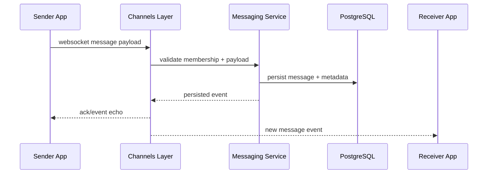

# Realtime

## Why WebSockets
WebSockets provide low-latency delivery for conversation updates and notifications without constant client polling.

## Realtime Events
- New chat message in an active conversation.
- Unread notification count updates.
- Task/application status changes relevant to the user.
- Payment-related state updates (for eligible participants).

## Consistency Strategy
- Events are persisted in PostgreSQL before broadcast.
- Clients re-fetch current conversation/notification state on reconnect.
- Server-side authorization limits event streams to permitted participants.

## Endpoints
- `ws://localhost:8000/ws/chat/<conversation_id>/`
- `ws://localhost:8000/ws/notifications/`

## Sequence Diagram

