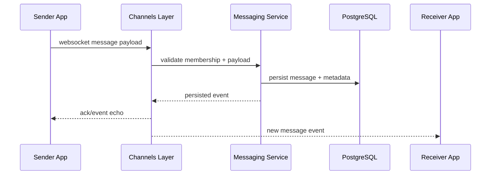

# Realtime

This page defines how MultiTask delivers low-latency updates for chat and notifications while preserving consistency with persisted backend state.

## Why Realtime

WebSockets are used to reduce polling and provide immediate feedback in collaboration-heavy workflows.

## Realtime Surfaces

- Conversation threads and live message delivery.
- Notification inbox and unread badge updates.
- Selected task or payment state changes relevant to participants.

## WebSocket Channels

- `ws://localhost:8000/ws/chat/<conversation_id>/`
- `ws://localhost:8000/ws/notifications/`

## Event Reliability Strategy

- Persist message/notification records before broadcasting events.
- Authorize channel subscription by JWT identity and membership.
- Re-fetch canonical API resources after reconnect or suspected drift.
- Use unread counters and message timestamps as reconciliation anchors.

## Message Delivery Sequence

## Recommended Client Behavior

1. Connect websocket after authenticated session is available.
2. Optimistically render local message while waiting for server ack.
3. Replace temporary message with persisted payload returned by event.
4. On disconnect, reconnect and re-fetch latest messages/notifications via REST.
5. Ignore events for conversations not in active scope.

## Security Controls

- Reject anonymous or expired-token websocket connections.
- Enforce participant-only access for conversation streams.
- Validate payload schema before persistence and fanout.

## UI Evidence

| Realtime Area | Preview |
|---|---|
| Conversation view |  |
| Notifications center |  |
| Notifications dropdown |  |

## Related Pages

- [API](api.md)
- [Architecture](architecture.md)
- [Security](security.md)
