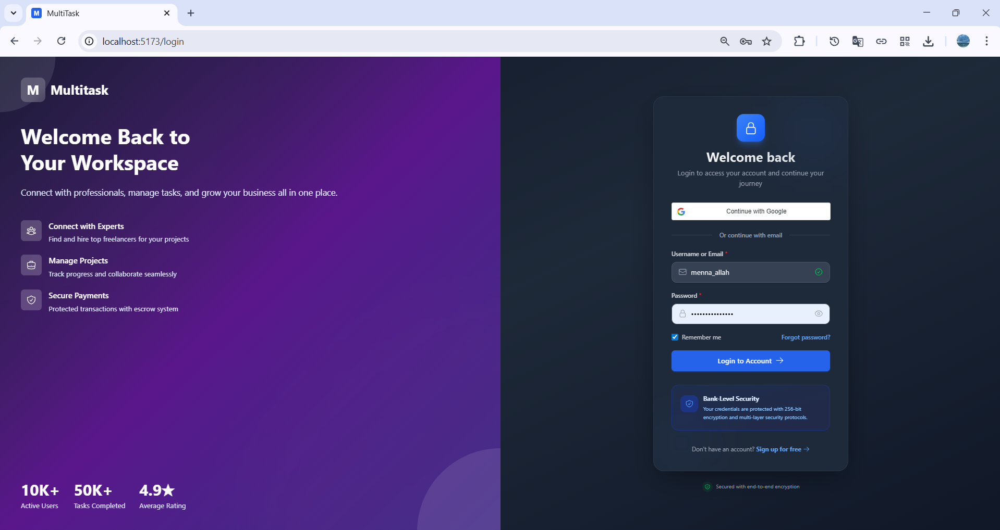
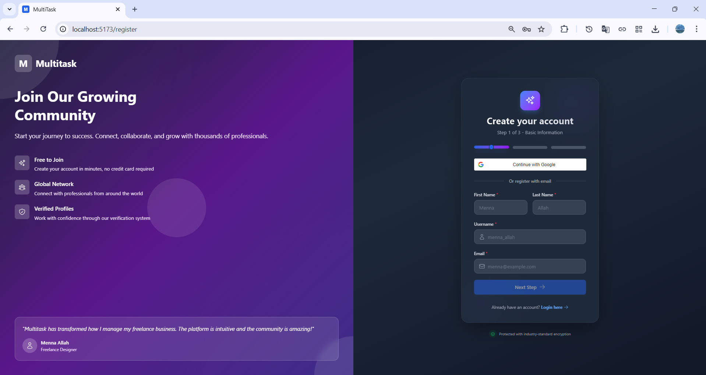
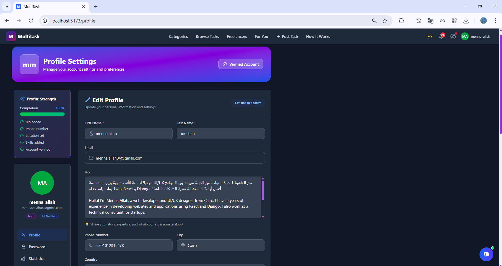

# Security

This page summarizes authentication, authorization, data handling, and security posture expectations for MultiTask.

## Authentication Model

- JWT-based access and refresh tokens.
- Access token lifetime: 60 minutes.
- Refresh token lifetime: 7 days.
- Session continuity via refresh endpoint.

## Login Methods

- Email or username with password.
- Google OAuth social login.

## Password Policy

- Minimum 8 characters.
- At least one uppercase letter.
- At least one numeric digit.

## Authorization Strategy

- Protected API routes require `Authorization: Bearer <token>`.
- Role checks enforce `client`, `freelancer`, and `both` boundaries.
- Ownership checks restrict task mutation and sensitive resource access.
- WebSocket subscriptions validate identity and conversation membership.

## Token Storage Decision

Current frontend stores tokens in `localStorage`.

### Trade-offs

- Advantage: simple SPA session lifecycle.
- Risk: higher exposure under XSS than HttpOnly cookie strategy.

### Mitigations

- Strict input and output sanitization.
- Dependency auditing and patch hygiene.
- Content Security Policy hardening.
- Centralized auth guards and route checks.

## Secrets and Configuration

- Secrets are environment-injected.
- Public docs include placeholders only.
- Never commit real credentials.

Sensitive keys include:

- Django secret key
- Database credentials
- Stripe secret and webhook secret
- Gemini API key
- Email provider credentials

## Data Handling Principles

- Treat profile and payment-related fields as sensitive.
- Limit access to owners and authorized service actions.
- Avoid logging secrets or unnecessary personal data.
- Preserve auditability for payment-impacting state changes.

## Hardening Checklist

- Enable strict CSP and security headers in production.
- Add rate limiting for auth and password-reset endpoints.
- Enforce HTTPS for all environments beyond local dev.
- Rotate secrets and revoke compromised tokens quickly.
- Monitor authentication anomalies and suspicious webhook calls.

## UI Evidence

| Security-Relevant Surface | Preview |
|---|---|
| Login |  |
| Register |  |
| Profile settings |  |

## Related Pages

- [API](api.md)
- [Realtime](realtime.md)
- [Payments](payments.md)
